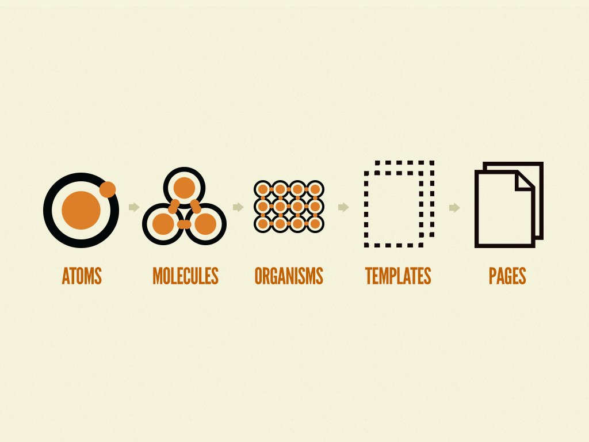

## Atomic Pattern이란?



atomic pattern이란, 소스코드를 아주 작은 컴포넌트 단위로 먼저 쪼개는 방법을 의미한다. 이렇게 하는 이유는 **컴포넌트의 중복을 최소화 하기 위함**이다. 총 5개의 폴더 구조로 이루어지며, 화학점 관점에서 영감을 얻은 디자인 패턴이다.

개발에만 적용되는 개념이 아니며, 디자인의 세계에서도 널리 알려진 패턴이다. 따라서, atomic pattern을 사용하면 디자이너와의 협업에서 유리해질 수 있고, 프로젝트 시작부터 체계적인 UI적 설계가 가능해진다.

현재 웹 프론트 개발에 가장 많이 쓰이는 프레임워크인 React, Vue, Flutter 모두 컴포넌트 단위로 개발을 진행하기 때문에 이러한 컴포넌트 중심 설계 패턴이 더욱 주목 받게 되었다.

하지만, 프로젝트 시작부터 UI를 디자이너와 함께 설계해야하므로 실제 개발 준비까지 걸리는 시간이 오래 걸릴 수 있다. 따라서 시간, 비용, 팀의 상황 등에 따라 적용하는 것이 일반적이다.

그렇다면 각 컴포넌트의 역할은 무엇이고 구체적으로 어떤 부분에 집중해서 개발해야 할지 알아보자.

### Atom(원자)

- 원자는 말그대로 더 이상 분해할 수 없는 가장 작은 단위의 컴포넌트이다.
- 원자는 어떠한 context가 주어지든지 이에 해당하는 컴포넌트가 생성될 수 있어야 한다.
- label, input, button과 같이 기본 HTML element 태그 혹은 글꼴, 애니메이션 등과 같이 추상적인 요소도 포함될 수 있다.
- 원자는 마진이나 위치값을 가지고 있지 않는다.

### Molecule

- molecule은 여러 개의 atom을 결합하여 자신의 고유한 특성을 가진다.
- molecule의 중요한 점은 한 가지 일을 하는 것입니다.

### Organism

organism은 앞 단계보다 좀 더 복잡하고 서비스에서 표현될 수 있는 명확한 영역과 특정 context를 가집니다. 예를 들어, header라는 context에 logo(atom), navigation(molecule), search form(molecule)을 포함할 수 있다. atom, molecule에 비해 좀 더 구체적으로 표현되고 context를 가지기 때문에 상대적으로 재사용성이 낮아지는 특성을 가진다.

### Template

템플릿은 page를 만들 수 있도록 여러 개의 organism, molecule로 구성할 수 있다.

### Page

페이지는 유저가 볼 수 있는 실제 콘텐츠를 담고 있다.

> 인용 :
> https://fe-developers.kakaoent.com/2022/220505-how-page-part-use-atomic-design-system/ 
> https://zoomkoding.github.io/%EB%94%94%EC%9E%90%EC%9D%B8%ED%8C%A8%ED%84%B4/%EC%9A%B0%EC%95%84%ED%95%9C%ED%85%8C%ED%81%AC%EC%BA%A0%ED%94%84/2020/07/09/atomic-design-pattern.html

```toc

```
