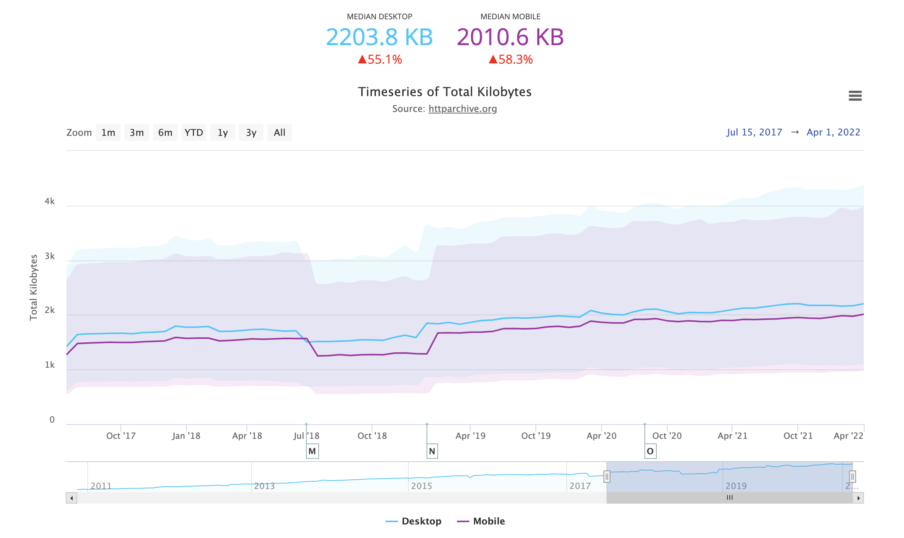
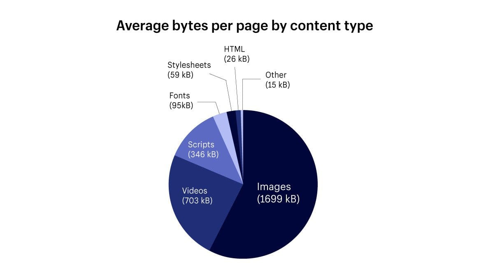
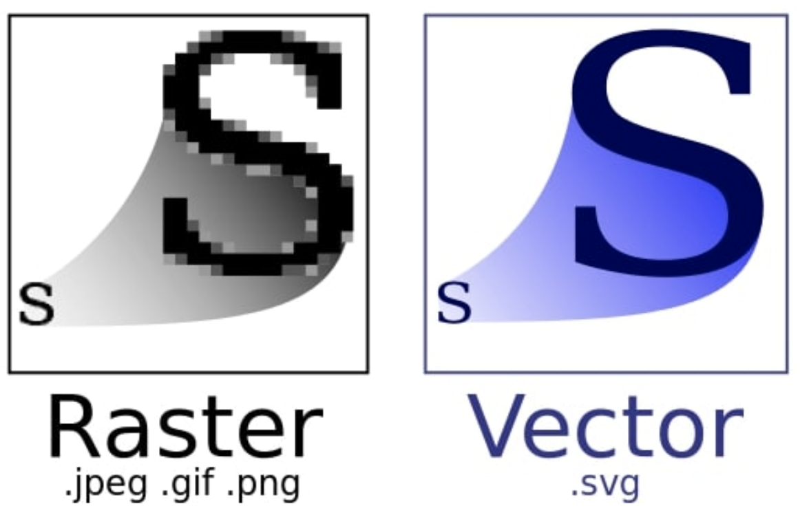
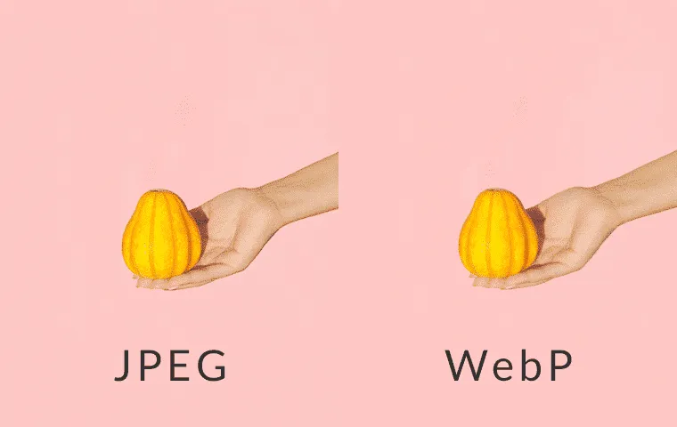
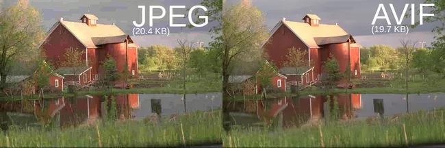
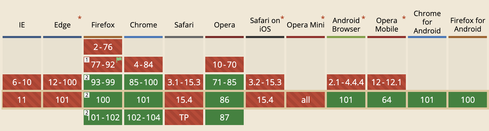
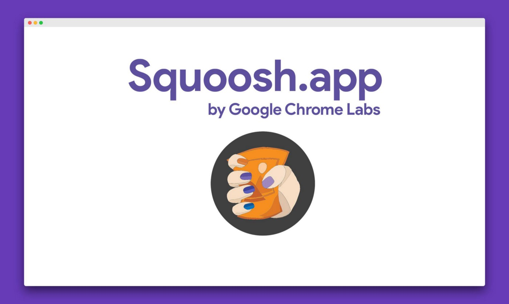

## 이미지의 중요성

<p align="center">
  
</p>

최근 들어, 초고속망 인터넷과, 그에 따른 사용자의 니즈로 인하여 웹페이지는 무게는 점점 더 무거워지고 있다. 위 사진을 보면, 2017년엔 1420.8kb이던 웹사이트의 무게가 2022년 현재는 2203.8kb로 무려 55%나 무거워졌기 때문이다. 특히 E-Commerce는 사이트 특성상 사진이 많이 들어가고, 상품을 팔기 위해선 사진은 빠질 수 없는 가장 중요한 요소이며, 이미지의 사이즈는 판매와도 직결되는 부분이다. 왜냐하면 [KissMetrics](https://neilpatel.com/blog/loading-time/)의 연구 결과에 따르면 페이지 로딩이 약 1초씩 느려질 때마다 상품을 구매하는 사용자의 비율은 약 7%씩 감소할 수 있다고 한다. 그러므로 이미지 최적화는 프론트엔드 개발자의 숙명이라고 할 수 있다.

## 웹사이트 이미지 체크

<p align="center">
  
</p>

HTTP 아카이브 연구에 따르면 평균 웹사이트의 반 이상이 이미지로 이루어져 있으며, 이미지의 용량도 다른 콘텐츠에 비해 월등히 높다고 한다. 따라서 이미지의 사이즈를 적절히 줄이고, 렌더링 속도를 빠르게 하면, 웹사이트의 렌더링 성능은 더욱더 빨라질 것이다.

하지만 먼저 이미지를 최적화하기 전에, 이미지를 최적화할 필요가 있는지부터 확인해 보아야 한다. 왜냐하면 이미지가 중요한 사이트가 아니라면 굳이 이미지를 최적화하는데 드는 리소스와 비용을 투자할 이유가 크게 없기 때문이다. (이미지 지연 로딩 등을 이용해 이미지의 우선순위를 낮추고 다른 중요한 콘텐츠부터 불러오는 게 좋다)

## 이미지의 종류 및 특성

이미지 최적화는 적절한 디지털 이미지 타입의 선택이 반이라 해도 과언이 아니다. 따라서 브라우저에 뿌려지는 디지털 이미지에 대해서 알아볼 필요가 있다. 디지털 이미지는 일반적으로 브라우저에서 어떻게 렌더링 되느냐에 따라 래스터 이미지 타입과 벡터 이미지 타입, 그리고 이미지의 손실을 어느 정도 허용하는지에 따라, 무손실 이미지 타입과 손실 이미지로 구분이 된다. 그러면 먼저 래스터 이미지와 벡터 이미지에 대해서 알아보자.

### 래스터 이미지와 벡터 이미지

<p align="center">
  
</p>

먼저 래스터 이미지는 정사각형 모양의 픽셀들이 모자이크처럼 모여 만들어지는 특징 덕분에 자연스러운 표현에 적합하다. 개발자들이 주로 사용하는 JPEG, PNG, GIF 등이 대표적인 래스터(비트맵) 이미지다. 픽셀의 수는 래스터 이미지의 사이즈와 해상도에 결정적인 영향을 미친다. 픽셀의 수가 많을수록 정교하게, 더 큰 래스터 이미지를 만들 수 있기 때문이다. 다만 사이즈가 커질수록 이미지의 용량도 늘어나고 렌더링 속도도 현저히 떨어지게 된다. 또한 래스터 이미지는 원본을 확대하거나 축소하면 계단처럼 깨져보이는 등 품질이 저하될 수 있다.

반면, 벡터 이미지는 픽셀값으로 그림을 그리는 게 아닌 이미지 안에 수많은 수학 방정식을 포함하고 있는 방식의 이미지 형태이다. 그렇기 때문에 컴퓨터는 선의 표현, 크기, 색상 등의 정보를 이미지안에 있는 계산식으로 연산하여 이미지를 제공한다. 이러한 연산을 사용하는 이미지 렌더링 방식 덕분에, 벡터 이미지는 사이즈가 커지거나, 작아져도 이미지가 깨지거나 정보가 달라지지 않는다. 그 말은 즉, 항상 같은 이미지 품질을 유지할 수 있다는 말! 이 벡터 이미지는 보통 아이콘, 폰트 등에 주로 사용되며, 대표적인 W3C 포맷인 SVG가 많이 사용된다. 다만, 이미지가 복잡하면 복잡할수록 이미지 안에 수학적인 정보는 계속해서 늘어나게 되고, 이미지 용량 또한 같이 늘어나게 된다.

### 무손실 이미지와 손실 이미지

레스터 이미지와 벡터 이미지와 더불어 이미지를 구분하는 또 다른 기준은 이미지의 정보 손실을 허용하는지의 안 하는지의 여부이다. 여기에서 많이들 오해하고 있는 것이 있는데, 무소실 이미지는 원본 이미지가 아니다. 원본 이미지는 말 그대로 이미지의 모든 정보를 가지고 있는 이미지를 말하고, 무손실 이미지는 원본 이미지에서 이미지를 렌더링하는데 필요하지 않은 정보들을 제거한 이미지를 무손실 이미지라고 한다. 따라서 무손실 이미지는 원본 이미지보다 용량이 줄어들 수 있다. GIF, PNG가 대표적인 무손실 이미지이다. 

손실 이미지는 무손실 이미지의 화질 감소를 감수하면서도 사이즈를 줄여 빠른 렌더링을 할 수 있는 이미지다. 손실 이미지의 사용은 무손실 이미지보다 상대적으로 빠른 렌더링이 가능하므로 사용자에게 꼭 필요한 정보를 주는 이미지가 아닌 경우 사용되는 이미지다. JPEG가 가장 대표적인 손실 이미지이며, 그 외로 JPEG 2000등이 존재한다. 

### 이미지 선택

그렇다면 이미지 개선을 위해 어떠한 이미지를 사용해야 할까? 이미지 최적화라는 단어를 보았을 때, 압축률이 높고 정보 손실이 적은 이미지를 선택하는 것이 가장 좋아보이지만, 용량, 지원 브라우저 등 적당한 타협이 필요하다. 이미지 렌더링 속도는 이미지 용량에 비례한다. 따라서 화질이 중요한 배너 이미지나 메인 이미지는 좀 더 손실이 적은 이미지로, 화질과 상관없는 이미지는 손실률이 높지만, 용량이 작은 이미지로 선택을 고려해야한다. 현재 상용에서 많이 쓰이는 포맷인 WebP와 최근 각광을 받고 있는 AVIF 대해서 자세히 알아보자.

### WebP

<p align="center">
  
</p>

WebP는 2010년 구글에서 개발한 이미지 포맷으로 손실 압축과 비손실 압축을 전부 지원하는 특징을 가지고 있다. VP8이라는 비디오 코덱 기술을 기반으로 한 영상압축 방식을 사용하며 파일크기를 25~35% 정도로 압축을 할 수 있는 이미지 포맷이다. 또한, 투명, 애니메이션 기능도 지원하므로 GIF, PNG, JPEG 등의 상용 이미지 포맷을 대체할 수 있다. 하지만 디바이스에 사양에 따라서, 상용 이미지 포맷보다 더 높은 리소스를 필요해 하거나, IE를 지원하지 않는 점, *Progressive Image 기능을 지원하지 않는다는 것이 단점이다. 그럼에도 불구하고, 현재 많은 곳에서 사용하고 있는 이미지 포맷이다.

##### *Progressive Image

<p align="center">
  
</p>

Progressive Image는 이미지가 저품질로 시작하여, 시간에 따라 해상도가 향상되는 이미지를 말한다. 이를 통해, 브라우저가 받는 리소스 파일의 크기를 줄여 랜더링 속도 향상 효과를 얻을 수 있다. (전체 이미지의 크기는 약간 증가한다) 이러한 방식은 일정 시간이 소요됨에도 불구하고, 사용자에게 마치 더 빠르게 다운로드 되는 듯한 착각을 불러일으킬 수 있습니다.

### AVIF

<p align="center">
  
</p>

AVIF는 2017년 AOMedia에서 개발한 이미지 포맷으로 손실 압축과 비 손실 압축을 전부 지원하기 때문에 WebP와 마찬가지로 GIF, PNG, JPEG 등의 상용 이미지 포맷을 대체할 수 있다. 또한 애니메이션 기능이 있어 움직이는 이미지로 쓸 수 있고, 압축 효율이 WebP보다 뛰어나, 많은 관심을 받고있는 이미지 포맷이다.

<p align="center">
  
</p>

하지만, 최신 포맷인 만큼 낮은 범용성으로 인하여, AVIF를 지원하는 뷰어가 적고, 브라우저 지원율이 아직은 많이 낮다. 또한, 단순한 패턴의 이미지를 압축하는 경우 PNG보다 낮은 압축률을 보여질 때도 있다. 그럼에도 불구하고, [넷플릭스에서는 AVIF 도입](https://netflixtechblog.com/avif-for-next-generation-image-coding-b1d75675fe4)을 검토 중에 있으며, Next.js에서는 AVIF를 지원하고 있다.

## 이미지 최적화 방법

이제 이미지에 대해서 어느 정도 알게 되었고, 각각의 목적에 맞는 이미지가 무엇인지 알 수 있었다. 그렇다면 이걸 가지고 어떻게 이미지를 최적화할까? 아래와 같이 이미지를 최적화 하는 방법은 다양하다. 자세한 활용법은 [올리브영 기술블로그](https://tech.oliveyoung.co.kr/tech/2111220929/) 글을 살펴보자. 

- 브라우저 사이즈에 맞춰 적절한 이미지 제공
  - 미디어 쿼리 활용
  - ````태그의 srcset 속성 사용하는 방법
  - ``<picture>``태그를 사용하는 방법
- Lazy Loading
- 이미지 CDN 사용
- CSS Image Sprite

### squoosh

<p align="center">
  
</p>

이 글에서 다룰 이미지 최적화 방법으로는 구글에서 만든 [squoosh](https://squoosh.app/) 서비스를 이용하여 이미지 파일을 압축하는 방법이다. 이미지 용량를 줄이는 가장 확실한 방법은 압축률이 더 높은 이미지 형식으로 파일을 변환하거나, 이미지 해상도를 낮추는 것이다. 

squoosh를 이용하면 원하는 형식과 원하는 해상도로 이미지를 리사이징 할 수 있다. 또한 webP와 AVIF를 지원하며, CLI를 제공하기 때문에 개발자들이 사용하기 편하다.

> ✨ 인용
> https://tech.oliveyoung.co.kr/tech/2111220929/

```toc

```
