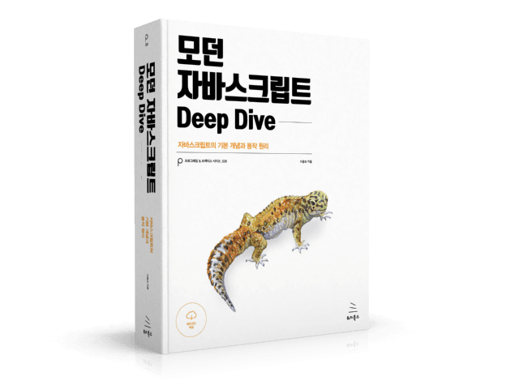
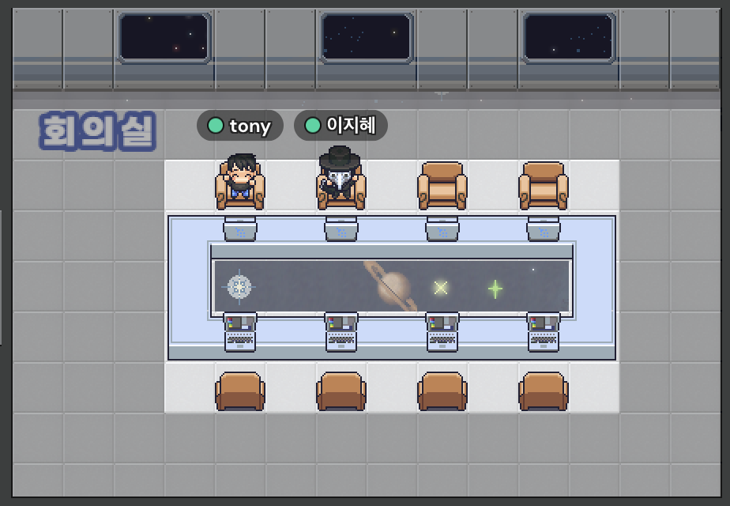

## 스터디에 참여한 이유

자바스크립트에 대한 기초가 부족한 채로 SPA 프레임워크를 사용하여 프로젝트를 해오니 간단한 오류 하나 잡는 것에도 시간이 많이 들었다. 최신 기술 스택들을 따라가기 보다는 기초가 튼튼한 개발자가 되어야겠다고 마음을 먹고, okky를 통해서 스터디를 찾아 참여하게 되었다.

## 스터디 진행

<p align="center">
  
</p>

스터디는 게더타운에서 평일 밤 10시에 모여 진도에 맞는 챕터를 각자 1시간동안 읽고, 토론을 하는 식으로 진행했다. 보통 30분 정도 토론을 했고, 길어지면 12시를 넘기는 날도 있었다.

진도를 다 끝내는 데 2달 정도 걸렸다. 학생, 취준생, 현업자로 다양한 사람들로 구성되었다. ~~마지막엔 나 포함 2명밖에 남지 않았지만..~~ 스터디 내내 개발 초보가 보는 관점과 현업에 계신 분의 관점이 이렇게 다르구나를 느낄 수 있었다. 역시 아는 만큼 보인다..!

[모던 자바스크립트 Deep Dive 스터디](https://github.com/leedawnn/javascript-deep-dive) 레포지토리를 통해 진도 체크를 하였고, 자유롭게 글을 올리는 식으로 진행되었다. 난 TIL을 해오고 있었기 때문에, TIL에 새롭게 배우게 된 내용을 따로 정리했다. 끝나고보니 TIL은 한 눈에 보기가 힘들어서.. 그냥 스터디 레포에 올릴 걸 그랬다.. 🥲

[3월 TIL](https://github.com/leedawnn/TIL/tree/main/Daily/2022_03), [4월 TIL](https://github.com/leedawnn/TIL/tree/main/Daily/2022_04)을 보면 스터디 내용을 확인할 수 있다. 😃

## 회고

<p align="center">
  
</p>

총 49 챕터, 900페이지가 넘어가는 배게 같은 책을 혼자 읽었다면 이렇게 재미있게 읽지 못했을 것 같다. 이해가 잘 가지 않아서 갑갑한 마음이 들 때면 현업에 계신 분들이 강의도 해주시고ㅋㅋ 면접 관련한 꿀팁들도 마구 쏟아내 주셔서 감사한 마음이 크다. 😊 특히, 마지막까지 함께 해주신 토니님께 넘나 감사드린다.. 이력서까지 공유해주시고, 취준 방향에 대해서도 많은 얘기를 해주셨다 ㅠㅠ 좋은 사람들과 행복한 스터디를 하고 나니 더 많은 것을 배우고 싶은 마음이 든다 ㅎㅎ

```toc

```
