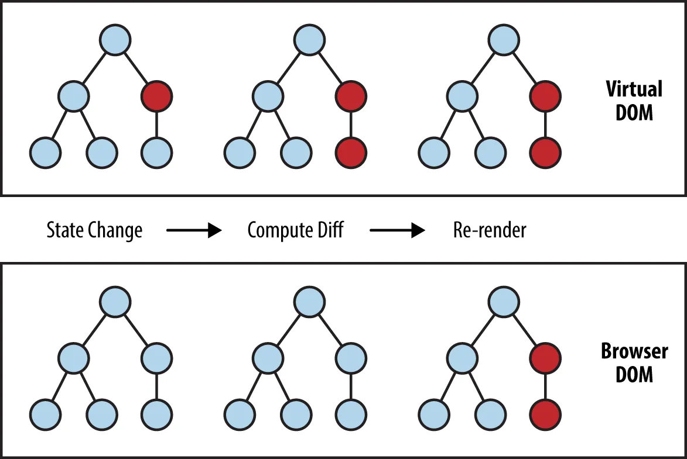

## React의 특징은 무엇일까

면접에서 빼놓을 수 없는 React 관련 질문들 중 React의 특징에 대해서 알아보자 😉

### 1. 컴포넌트 기반 설계

- 의미 단위로 컴포넌트 구성
- 재사용성과 유지보수성 증가
- 부모, 자식 관계를 가짐

### 2. Virtual DOM

<p align="center">
  
</p>

일반적으로 우리가 자바스크립트를 이용하여 DOM을 변경할 때, 브라우저가 DOM을 재구축하고 화면을 그리는 과정을 거치게 된다. 하지만 잦은 DOM 변경은 웹 사이트의 성능 문제를 야기한다.

그래서 React는 virtual DOM(가상돔)을 하나 만들어두고, 변경되어야할 DOM 요소를 미리 virtual DOM에서 모두 변경해두고 이것을 DOM(찐)에서 동기화시키는 방식을 사용한다. 이런식으로 하게 되면 DOM을 직접 변경시킬 때 발생하는 비효율을 어느정도 해결할 수 있게 된다.

### 3. 높은 자유도

컴포넌트는 고립되어 있고, 독립적이며 재사용이 가능하다. 그렇기 때문에 unit test가 가능해진다.

> Unit text란,
>
> - 유닛 테스트의 목적은 프로그램의 각 부분을 고립시켜서 각각의 부분이 정확하게 동작하는지 확인하는 것이다.
> - 즉, 프로그램을 작은 단위로 쪼개서 각 단위가 정확하게 동작하는지 검사하고 이를 통해 문제 발생 시 정확하게 어느 부분이 잘못되었는지를 재빨리 확인할 수 있게 해준다. 따라서 프로그램의 안정성이 높아진다.
> - 유닛 테스트는 일견 개발 시간을 증가 시키는 것처럼 보이지만 개발 기간 중 대부분을 차지하는 디버깅 시간을 단축시킴으로써 여유로운 프로그래밍을 가능케 한다.

### 4. 풍부한 생태계

React의 인기가 높아지면서 개발자들은 리액트를 활용한 다양한 라이브러리를 개발하고 배포하며 공유하고 있다. 때문에 npm에는 react 관련한 라이브러리들이 넘쳐난다.

또한 react 개발자들의 강력한 커뮤니티 형성으로 문서화가 잘 되어 있어, 에러를 마주쳤을 때 이를 해결할 수 있는 방법들을 쉽게 찾을 수 있다.

웹 애플리케이션뿐만 아니라 React Native로 모바일 어플리케이션, electron으로 데스크탑 어플리케이션을 만들 수 있는 장점도 가지고 있다.

```toc

```
