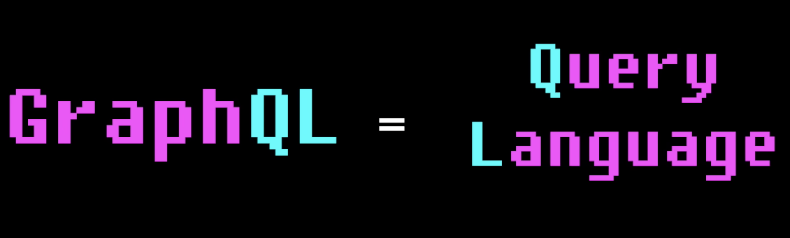

## 본론으로 들어가기 전

최근 FE 재남님이 라이브로 코딩하시는 걸 봤었는데, REST API보다 GraphQL이 편리한 이유에 대해서 설명하시는 걸 듣고 graphQL을 공부하고 싶어졌다. 공부하기 전에는 쿼리 언어라고 하길래 데이터베이스 관련이구나 하고 지나갔었는데,, 묘하게 반전.. 😬

이제 REST API보다 GraphQL을 쓰고 싶어진 이유에 대해 알아보자.

## graphQL이란?

GraphQL은 Facebook이 만든 API에 대한 쿼리 언어이다. GraphQL은 API에 대한 쿼리 언어이며 기존 데이터로 이러한 쿼리를 수행하기 위한 런타임입니다. GraphQL은 API의 데이터에 대한 완전하고 이해하기 쉬운 설명을 제공하며, 고객에게 필요한 것이 무엇이며 그 이상의 것이 없는지 정확히 물어볼 수 있는 힘을 제공하며, 시간이 지남에 따라 API를 더 쉽게 개발할 수 있도록 하며, 강력한 개발자 도구를 지원합니다.

## graphQL은 어떠한 문제를 해결할 수 있나?

일단 GraphQL 핵심을 살펴보자.

GraphQL은 Facebook에 의하여 REST API 문제를 해결하기 위해 만들어졌다.

> **API란 ?**  
> : 서버와 통신하기 위해 만들어진 인터페이스

가장 유명한 API는 REST API인데, REST API는 이해하기 쉽다는 장점이 있다.  
여러개의 URL을 활용하여 작동하며, 모든 URL은 고유하고 각기 다른 데이터를 제공한다.

하지만, **REST API**는 다음과 같은 2가지 문제점을 가지고 있다.  

#### 1. **Over Fetching**

#### 2. **Under Fetching**

**Over Fetching**이란 내가 필요한 것보다 더 많은 데이터를 가져온 경우를 말한다.  
예를 들면, 동물보호센터 정보를 가져오는 API가 있다고 해보자. 인천에 있는 보호소 정보를 알고 싶다면 ``http://apis.data.go.kr/1543061/animalShelterSrvc/shelterInfo``로 이동하면 된다. 그럼 아래와 같은 json 형태로 데이터를 받게 된다.

```json
{
  "name": "농림축산식품부 농림축산검역본부_동물보호센터 정보 조회서비스",
  "description": "유기동물 동물보호센터 등록정보를 제공하는 서비스 입니다. ‘보호센터등록번호’ 또는 ‘동물보호센터명’으로 조회가능하며, ‘상세 보호시설’ 정보가 등록된 경우에는 보호시설의 상세정보(영업 시간, 위/경도, 휴무일 등)을 함께 제공하며, 등록되지 않았을 경우 보호센터의 기본정보를 제공합니다",
  "url": "https://www.data.go.kr/data/15098915/openapi.do",
  "keywords": [
    "동물보호센터,유기동물,유기동물보호소,동물보호센터,유기동물"
  ],
  "license": "https://data.go.kr/ugs/selectPortalPolicyView.do",
  "dateCreated": "2022-02-10",
  "dateModified": "2022-02-10",
  "datePublished": "2022-02-10",
  "creator": {
    "name": "농림축산식품부 농림축산검역본부",
    "contactPoint": {
      "contactType": "동물보호과",
      "telephone": "+82-0549120515",
      "@type": "ContactPoint"
    },
    "@type": "Organization"
  },
  "distribution": [
    {
      "encodingFormat": "JSON+XML",
      "contentUrl": "https://www.data.go.kr/data/15098915/openapi.do",
      "@type": "DataDownload"
    }
  ],
  "@context": "https://schema.org",
  "@type": "Dataset"
}
```

보다시피 인천에 있는 동물보호소의 정보만 얻고 싶은데, 등록일, 전화번호 등 엄청 많은 정보를 얻게된다.
우리가 얻은 이 많은 정보들은 필요가 없는데 말이다.. 😟  

이와 같은 경우를 **Over Fetching**이라고 한다.

실제로 필요한 정보만 특정하여 요청한다면, DB가 일을 많이 할 필요도 없고 서버와 디바이스 간의 이동해야하는 데이터도 커지지 않기 때문에, 로딩 시간도 획기적으로 줄어들 것이다.

<p align="center">
  
</p>

GraphQL은 이러한 문제점을 해결한다! 왜냐하면 GraphQL은 쿼리 언어이기 때문이다.  
즉, 정확하게 필요한 정보만 요청할 수 있게 해준다.  

위에서 봤듯이 ``http://apis.data.go.kr/1543061/animalShelterSrvc/shelterInfo`` 이러한 URL로 요청해서 수 많은 데이터를 낭비하는 것이 아니라 GraphQL을 이용해서 필요한 정보만 달라고 서버로 쿼리를 보낸다.

문법도 아래와 같이 간결하다.

```graphql
{
  animalShelterInfo {
    shelterInfoIch
  }
}
```  

<br />

자, 이제 **Under Fetching**이 무엇인지 알아보자.  

이름만 봐도 Over Fetching과 반대되는 뜻을 가졌다고 추측할 수 있을 것이다.  
그렇다. **Under Fetching**은 필요한 것보다 적은 양의 데이터를 가져온 경우를 말한다.  

동물 보호 센터가 어디에 있는지 알려주는 사이트를 만드는데, 2개의 리스트를 생성한다고 해보자.

1. 전국에 있는 동물 보호 센터 개수
2. 인천에 있는 보호소 목록

REST를 사용한다면 2개의 각기 다른 URL로 요청을 보내야할 것이다.즉, 디바이스는 각기 다른 2개의 요청을 보내야한다는 말이다. 2개의 URL을 연속해서 접속해야하고, 이는 로딩 타임의 증가로 이어진다.  

GraphQL은 정확히 원하는 것만 요청할 수 있기 때문에, 2개의 각기 다른 요청을 보낼 필요가 없다!  
대신 1개의 쿼리에 2개의 정보를 한방에 요청할 수 있다 😆

```graphql
{
  animalShelterSrvc {
    allShelterNum
  }
  animalShelterInfo {
    shelterInfoIch
  }
}
```

<br />

GraphQL은 이러한 방식으로 **Over Fetching**, **Under Fetching**을 한 번에 해결한다.  
그 뿐만 아니라 GraphQL에는 멋진 기능들이 있어서 API를 보다 쉽게 만들 수 있다.  
GraphQL의 자세한 사용법은 공식문서를 참고하자.

<br />

> 🌱 인용 :  
> [nomad coders - 이 영상을 보고나면 REST API를 못쓰게 됩니다.](https://youtu.be/N-81mS2vldI)  
> [GraphQL 공식문서](https://graphql.org/)
> [공공데이터포털 - 동물보호센터 정보 조회서비스](https://www.data.go.kr/data/15098915/openapi.do)

```toc

```
