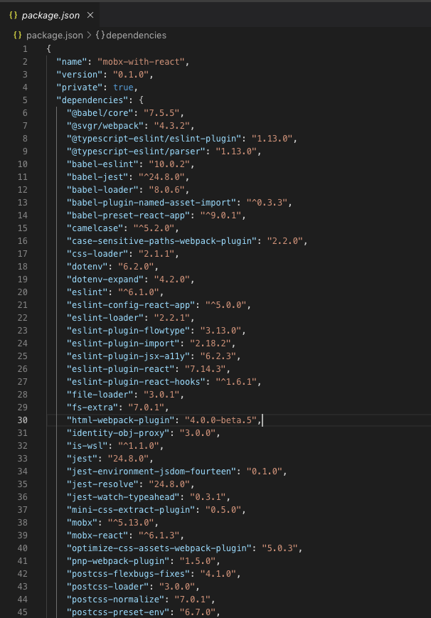

## CRA를 쓰는 이유

페이스북에서 개발한 [Create-React-App](https://reactjs.org/docs/create-a-new-react-app.html)(CRA) 보일러 플레이트를 사용하면 간편하게 리액트로 웹 애플리케이션을 만들 수 있다. CRA는 개발 환경을 구성할 때 필요한 여러가지 라이브러리나 웹팩의 설정 없이 쉽게 프로젝트를 시작할 수 있다. CRA에 대한 장점을 정리해보자.

- **One Dependency**
  one build dependency를 가진다. Webpack, babel, ESLint 등을 사용하지만 응집력 있는 큐레이션된 경험을 제공한다.
- **No Configuration Required**
  개발 환경을 위해 많은 것을 설정하지 않아도 된다. CRA는 프로젝트에 필요한 필수적인 설정(Configuration)을 대신 해준다.
- CRA는 Autoprefixer를 지원해준다. 즉, 일반적인 CSS코드 생성을 하게 되면 자동으로 -webkit-, -ms- 등을 자동으로 적용해준다.
- CRA를 이용하면 기존 기능을 개선하거나 새로운 기능을 추가했을 때 패키지 버전만 올리면 된다.

## eject를 쓰는 이유

Eject는 one build dependency를 가진 프로젝트를 custom하기 위한 방법이다.

```terminal
npm run eject
```

_Are you sure you want to eject? This action is permanent_

eject를 실행하면, 위와 같이 메세지가 나오는데 한번 실행하면 되돌릴 수 없다는 뜻이다. y를 입력하면 이어서 실행한다. 그러면 아래 사진과 같이 CRA에 종속되어 있던 많은 설정들이 나타나게 된다 😨

<p align="center"> 
  
</p>

**주의할 점은, 한번 eject를 수행하게 되면 이전 상태로 되돌아 갈 수 없다.**

그렇다해도 방법이 아예 없는 것은 아니다. [undo 'npm run eject' in react - Stack Overflow](https://stackoverflow.com/questions/51454729/undo-npm-run-eject-in-react)를 참고해서 eject 하기 전 상태로 복구할 수 있다.

이 방법은 매우 귀찮으니 커스터 마이징을 위해 eject가 필요하다면 처음부터 CRA를 사용하지 않는 것이 좋다.

## eject를 하면 안되는 이유

eject는 우리의 프로젝트를 자유롭게 customizing 한다는 점에서 매력적으로 보인다. 하지만 몇가지 CRA를 쓰면서 갖게 되는 이점을 포기하게 된다.

- CRA의 모든 configuration을 직접 유지보수 해야 된다. webpack, babel부터 프로젝트에 필요한 테스트 등 많은 작업이 필요하다. 협업을 해야하는 상황에서는 매우 힘든 과정이 아닐 수 없다.
- One Build Dependency의 장점을 잃게 된다. 작업 도중 하나의 패키지가 필요해서 설치한다거나 삭제할 때, 항상 다른 패키지들과의 의존성을 신경써야 한다.

## CRA의 안정성과 custom을 곁들이기 위해

이럴 땐, [CRACO](https://github.com/gsoft-inc/craco)를 사용하면 된다. CRA를 그대로 사용하면서 이 라이브러리를 통해 오버라이딩을 할 수 있다.

Craco(Create React App Configuration Override)는 create-react-app(CRA)을 쉽게 설정하기 위해 만들어졌다.

설치 방법은 아래 명령어를 입력하면 된다.

```terminal
$ yarn add @craco/craco

# OR

$ npm install @craco/craco --save
```

CRA에서 eject를 하지 않아도 root 폴더에 craco.config.js를 추가함으로 여러 설정을 할 수 있다. 자세한 내용은 깃헙 레포지토리에서 알아보자.

```toc

```
